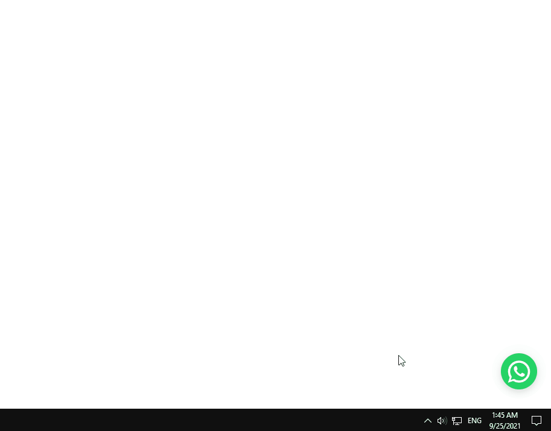

# React Floating WhatsApp Component 💬

> **The most customizable and feature-rich React WhatsApp floating button component** - Add professional WhatsApp integration to your website with TypeScript support, dark mode, notifications, and seamless user experience.

[](https://www.npmjs.com/package/@dxkit-org/react-floating-whatsapp)
[](https://bundlephobia.com/package/@dxkit-org/react-floating-whatsapp)
[](https://www.npmjs.com/package/@dxkit-org/react-floating-whatsapp)
[](https://github.com/dxkit-org/react-floating-whatsapp/blob/main/LICENSE)
[](https://www.typescriptlang.org/)

## 🌟 Why Choose React Floating WhatsApp?

Perfect for **e-commerce**, **customer support**, **lead generation**, and **business websites** that need instant customer communication. Used by thousands of developers worldwide!

<p align="center">
  
</p>

## 🚀 Quick Installation & Setup

### NPM Installation

```bash
npm install @dxkit-org/react-floating-whatsapp
```

### Yarn Installation

```bash
yarn add @dxkit-org/react-floating-whatsapp
```

### PNPM Installation

```bash
pnpm add @dxkit-org/react-floating-whatsapp
```

## 💻 Basic Usage Example

Get started in seconds with this simple implementation:

```jsx
import React from 'react'
import { FloatingWhatsApp } from '@dxkit-org/react-floating-whatsapp'

export default function App() {
  return (
    <FloatingWhatsApp
      phoneNumber='1234567890'
      accountName='Your Business'
      avatar='/path/to/avatar.jpg'
      statusMessage='Typically replies within 1 hour'
      chatMessage='Hello! 👋 How can we help you today?'
      darkMode={false}
      allowClickAway={true}
      allowEsc={true}
      notification={true}
      notificationSound={true}
    />
  )
}
```

## 🎨 Advanced Usage with Custom Styling

```jsx
import React from 'react'
import { FloatingWhatsApp } from '@dxkit-org/react-floating-whatsapp'

export default function App() {
  const handleSubmit = (event, message) => {
    console.log('Message sent:', message)
    // Add your custom logic here
  }

  return (
    <FloatingWhatsApp
      phoneNumber='1234567890'
      accountName='Customer Support'
      onSubmit={handleSubmit}
      className='custom-whatsapp-widget'
      buttonStyle={{ backgroundColor: '#25D366' }}
      chatboxStyle={{ borderRadius: '20px' }}
      darkMode={true}
      notification={true}
      notificationDelay={30}
    />
  )
}
```

## 📋 Complete API Reference & Props

Customize every aspect of your WhatsApp widget with these comprehensive props:

| Prop                    |     Type      | Options  | Description                                                                                                               |               Default                |
| ----------------------- | :-----------: | -------- | ------------------------------------------------------------------------------------------------------------------------- | :----------------------------------: |
| `phoneNumber`           |    String     | Required | Phone number in [intenational format](https://faq.whatsapp.com/general/contacts/how-to-add-an-international-phone-number) |             `1234567890`             |
| `accountName`           |    String     | Required | Account username                                                                                                          |            `Account Name`            |
| `onClick`               |   Function    | Optional | Callback function fires on click                                                                                          |                 `-`                  |
| `onSubmit`              |   Function    | Optional | Callback function fires on submit with event and form input value passed                                                  |                 `-`                  |
| `onClose`               |   Function    | Optional | Callback function fires on close                                                                                          |                 `-`                  |
| `onLoopDone`            |   Function    | Optional | Callback function called when notification loop done                                                                      |                 `-`                  |
| `onNotification`        |   Function    | Optional | Callback function fired when notification runs                                                                            |                 `-`                  |
| `avatar`                |    String     | Optional | Change user avatar using [static assets](https://create-react-app.dev/docs/adding-images-fonts-and-files/)                |              `UI Face`               |
| `statusMessage`         |    String     | Optional | Text below the account username                                                                                           |  `Typically replies within 1 hour`   |
| `chatMessage`           |    String     | Optional | Text inside the chat box.                                                                                                 | `Hello there! 🤝 \nHow can we help?` |
| `placeholder`           |    String     | Optional | Input placeholder.                                                                                                        |          `Type a message..`          |
| `messageDelay`          |    Number     | Optional | Time delay after which the chatMessage is displayed (in seconds).                                                         |                 `2`                  |
| `darkMode`              |    Boolean    | Optional | Dark style.                                                                                                               |               `false`                |
| `openChatOnClick`       |    Boolean    | Optional | open the chat box if clicked on whatsApp icon                                                                             |                `true`                |
| `allowDefaultSubmit`    |    Boolean    | Optional | Allow default submit behavior of redirecting to whatsApp on submit                                                        |                `true`                |
| `allowClickAway`        |    Boolean    | Optional | Closes the chat box when user clicks outside                                                                              |               `false`                |
| `allowEsc`              |    Boolean    | Optional | Closes the chat box when `Escape` key is pressed                                                                          |               `false`                |
| `className`             |    String     | Optional | CSS className applied to the main wrapping `Div`                                                                          |         `floating-whatsapp`          |
| `buttonClassName`       |    String     | Optional | CSS className applied to button                                                                                           |      `floating-whatsapp-button`      |
| `style`                 | CSSProperties | Optional | Inline style applied to the main wrapping `Div`                                                                           |                 `{}`                 |
| `buttonStyle`           | CSSProperties | Optional | Inline style applied to button                                                                                            |                 `{}`                 |
| `chatboxHeight`         |    Number     | Optional | Control chat box height                                                                                                   |                `320`                 |
| `chatboxClassName`      |    String     | Optional | CSS className applied to chat box                                                                                         |     `floating-whatsapp-chatbox`      |
| `chatboxStyle`          | CSSProperties | Optional | Inline style applied to chat box                                                                                          |                 `{}`                 |
| `notification`          |    Boolean    | Optional | Allow notifications (Disabled after user open the chat box)                                                               |               `false`                |
| `notificationDelay`     |    Number     | Optional | Time delay between notifications in seconds                                                                               |                 `60`                 |
| `notificationSound`     |    Boolean    | Optional | Allow notification sound                                                                                                  |               `false`                |
| `notificationSoundSrc`  |    String     | Optional | Notification sound custom src                                                                                             |                 `-`                  |
| `notificationLoop`      |    Number     | Optional | Repeat notifications loop                                                                                                 |                 `0`                  |
| `notificationStyle`     | CSSProperties | Optional | Inline style applied to notification                                                                                      |                 `-`                  |
| `notificationClassName` |    String     | Optional | CSS className applied to notification indicator                                                                           |   `floating-whatsapp-notification`   |

<br />

## 🎯 Live Demo & Playground

[](https://codesandbox.io/s/react-floating-whatsapp-183py)

Try it live on CodeSandbox and see all features in action!

## ✨ Key Features & Benefits

- 🚀 **Zero Configuration** - Works out of the box with minimal setup
- 💼 **Full TypeScript Support** - Complete type safety and IntelliSense
- 🎨 **Highly Customizable** - Custom styling with CSS classes and inline styles
- 🌙 **Dark/Light Mode** - Built-in theme switching capability
- 🔔 **Smart Notifications** - Configurable notification system with sound support
- 📱 **Mobile Responsive** - Perfect on all devices and screen sizes
- ⌨️ **Accessibility Ready** - Full keyboard navigation and ESC key support
- 🖱️ **Click Outside to Close** - Intuitive user interaction patterns
- 🎯 **Event Callbacks** - Hook into click, submit, close, and notification events
- 📞 **Direct WhatsApp Integration** - Seamless connection to WhatsApp Web/App
- ⚡ **Lightweight** - Minimal bundle size impact on your application
- 🔧 **Framework Agnostic** - Works with Next.js, Gatsby, CRA, and more

## 🏢 Perfect For

- **E-commerce Websites** - Instant customer support and sales assistance
- **Business Websites** - Lead generation and customer inquiries
- **Service Providers** - Quick booking and consultation requests
- **SaaS Applications** - User support and onboarding assistance
- **Portfolio Sites** - Direct client communication
- **Landing Pages** - Convert visitors into leads

## 🌐 Browser Support

- ✅ Chrome (Latest)
- ✅ Firefox (Latest)
- ✅ Safari (Latest)
- ✅ Edge (Latest)
- ✅ Mobile browsers (iOS Safari, Chrome Mobile)

## 📦 What's Included

- React component with TypeScript definitions
- Default avatars and sound files
- CSS modules for styling
- Comprehensive documentation
- Live examples and demos

## 🤝 Contributing & Support

We welcome contributions! Please see our [Contributing Guide](CONTRIBUTING.md) for details.

- 🐛 **Bug Reports**: [GitHub Issues](https://github.com/dxkit-org/react-floating-whatsapp/issues)
- 💡 **Feature Requests**: [GitHub Discussions](https://github.com/dxkit-org/react-floating-whatsapp/discussions)
- 📧 **Email Support**: [adarsh@primexop.com](mailto:adarsh@primexop.com)

## 📊 NPM Stats

- **Weekly Downloads**: Growing rapidly
- **Bundle Size**: Lightweight and optimized
- **Dependencies**: Minimal peer dependencies (React 18+)
- **TypeScript**: Full type coverage

## 🔗 Related Packages

Looking for more React components? Check out our other packages:

- `@dxkit-org/react-components` - Complete UI component library
- More coming soon!

## ⭐ Show Your Support

If this package helped you, please consider:

- ⭐ Starring the [GitHub repository](https://github.com/dxkit-org/react-floating-whatsapp)
- 🐦 Sharing on Twitter with #ReactFloatingWhatsApp
- 📝 Writing a review or blog post
- 🤝 Contributing to the project

## 🙏 Credits & Acknowledgments

This project is forked from [awran5/react-floating-whatsapp](https://github.com/awran5/react-floating-whatsapp/) with significant enhancements including:

- TypeScript improvements
- Additional customization options
- Enhanced notification system
- Better accessibility
- Improved documentation
- Bug fixes and stability improvements

Special thanks to all contributors and the React community!

## 📄 License

MIT © [dxkit-org](https://github.com/dxkit-org/)

---

<div align="center">

**Made with ❤️ by the dxkit-org team**

[Website](https://github.com/dxkit-org) • [Twitter](https://twitter.com/dxkit_org) • [GitHub](https://github.com/dxkit-org)

_Don't forget to ⭐ star this repository if it helped you!_

</div>
